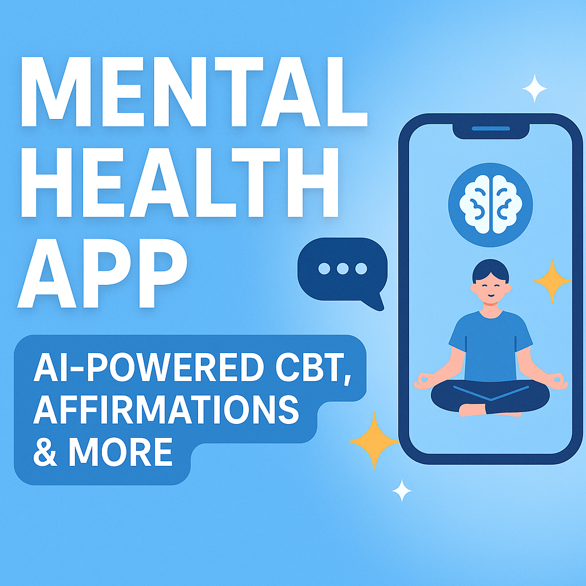

# 🧠 Mental-Health-AI-App --Your Mental Wellness Companion  

**Mental-Health-AI-App** is a holistic mobile app built with **Kivy** and **KivyMD** that helps users explore, heal, and grow through advanced mental health tools powered by AI. This project combines therapeutic techniques like **CBT (Cognitive Behavioral Therapy)**, **Law of Attraction**, **Thought Reframing**, **Visualization**, and **self-assessment tests** — all in one seamless experience.

---

---

  

---
## ✨ Features

### 🧩 Motivation Hub  
- **Quote of the Day** with mood-based reflections  
- **Riddle-based engagement** for mindfulness and curiosity  
- **Voice recording** to capture reactions or emotional responses to quotes  

### 🧠 Positive Mind Lab  
- **CBT Module**  
  - AI-powered thought reframing  
  - Imagery-based CBT with guided visual exercises  
  - Daily journaling & thought tracking  
- **Law of Attraction**  
  - Affirmation builder with voice recording  
  - Goal tracking and consistency streak  
  - Visualization sessions for goal alignment  
- **Visualization with Affirmation**  
  - Educational content: Overview, How it Works, Steps  
  - Guided mental imagery combined with personalized affirmations  

### 💬 Question Room (RAG-powered Chatbot)  
- Choose from topics like anxiety, depression, relationships, etc.  
- Uses **Gemini AI** + **RAG (Retrieval Augmented Generation)** to answer user queries based on handpicked PDFs  
- Unlike generic AI chatbots, answers are based on **real mental health literature** relevant to the chosen category  

### 🧪 Self-Assessment Test Screen  
- 5 clinical and psychological tests to help users assess their mental state:  
  - Cognitive Bias Test  
  - Emotional Stroop Test  
  - GAD (General Anxiety Disorder) Test  
  - PHQ-9 (Patient Health Questionnaire for depression)  
  - DASS-21 (Depression, Anxiety & Stress Scale)  
- Shows **score + symptoms** to help users self-monitor their progress  

### 🗣️ Daily Thought  
- Enter daily thoughts manually  
- Uses **Gemini AI** for real-time thought reframing  
- Tracks your mood and mental state over time  
- Stores all entries for reflection  

### 🔍 Issues & Emotional Support Modules  
- Special screens focused on common problems like:  
  - **After Love (Breakup Support)**  
  - **Anxiety Management**  
  - More planned for future expansion  

---

## 🧠 What Problems It Solves

- Helps users **identify and manage anxiety, depression, and overthinking** through clinically backed methods  
- Offers **daily structure and motivation** to people with mental fatigue or lack of routine  
- Gives users a **safe space to self-reflect**, reframe thoughts, and grow emotionally  
- Combines **AI guidance with therapy-inspired tools** for scalable, personalized self-help  
- Brings together **mental health education, action, and progress tracking** in one place  

---

## ⚙️ Tech Stack

| Area                 | Technology Used                      |
|----------------------|---------------------------------------|
| **Framework**        | Kivy, KivyMD                          |
| **Language**         | Python                                |
| **AI Integration**   | Gemini AI, RAG (Retrieval-Augmented Generation) |
| **Voice Features**   | `speech_recognition`, `pyttsx3` for TTS, `sounddevice` for recording |
| **Image Generation** | black-forest-labs API (for visual imagery generation) |
| **Data Handling**    | JSON-based form storage, local session tracking |
| **Design**           | KivyMD UI components, custom vector art for modules |
| **Testing**          | Manual UI testing on Android (Buildozer-ready) |

---

## 🚀 Current Status

✅ **70% Complete** — All core modules are working  
🔄 UI polish and edge-case handling in progress  
🧪 Final testing + APK build planned after visual/audio feedback optimization

---

## 📹 How to Experience It

Since this app is still in development, the APK is not yet released.  
However, a full **demo video** is available in my portfolio showcasing:

- Navigation between modules  
- CBT sessions with AI  
- Visualization walkthroughs  
- Real conversations in Question Room  
- Live thought reframing using Gemini AI  

---

## 🎬 Project Demo

  
   
  <strong><a href="https://youtu.be/wlqpN3FJWkk" target="_blank">▶️ Watch: Mental Health AI App</a></strong>
  
Video by Data Science Solutions

> ⚠️ GitHub does not support embedding actual YouTube videos. Clicking the image will open the video in a new tab.

---

## 🧘 Future Plans

- Mood calendar & journaling streak view  
- Community question board with AI moderation  
- Offline support  
- Firebase or SQLite-based local database  
- Expand test library with PTSD, sleep scale, etc.  

---

## 📇 Author

Made with love & focus by **Uvais Saifi**  
Connect on [LinkedIn](https://www.linkedin.com/) | GitHub: [@Uvais5](https://github.com/Uvais5)

---

## 📌 Note

This app is not a substitute for clinical diagnosis or therapy. It is built for self-help, educational, and motivational purposes only.

---

